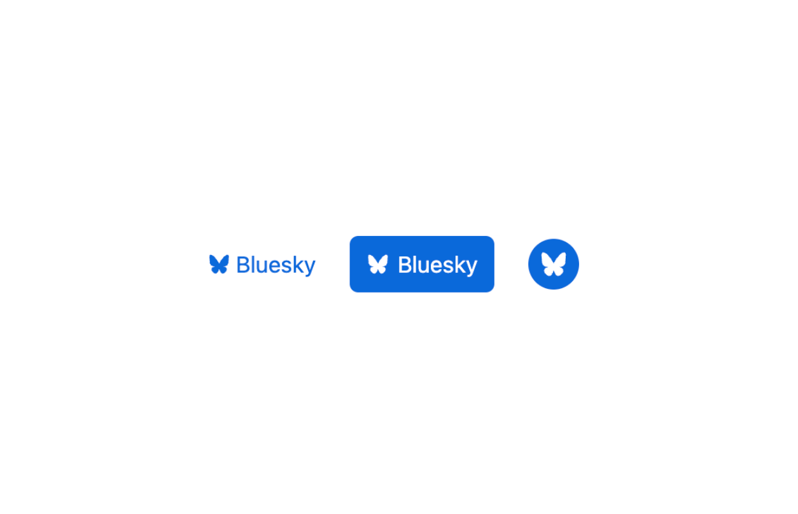

# Bluesky icon

The [Bluesky icon](https://bsky.app/) based on [Bluesky APP code](https://github.com/bluesky-social/social-app/commit/d59340017860c9d2ec9f4927b329a9c14dc6f7f7).

## Examples

Let's check out how it [looks in action](https://play.tailwindcss.com/2kv7sbJR0P):

## Color variants

Basic version of the icon is [black](dist/bluesky-icon.svg) color. There are also a [white](dist/bluesky-icon.white.svg)
and [blue](dist/bluesky-icon.blue.svg) color variants. Check out [dist](dist) folder for more formats.

## Source files

Base icon was created in [Affinity Designer](https://affinity.serif.com/en-gb/designer/),
but there is also SVG version in [src](src) folder.

## How to make changes?

1. Fork this repository and clone it
2. Install [Node.js](https://nodejs.org/en/) and [Yarn](https://yarnpkg.com/)
3. Run `yarn install` to install dependencies
4. Run `yarn build` to build icons from [source file](src/bluesky-icon.svg)

Send PR with your changes.

## Icon history

Original butterfly icon was originally designed by [Paul Frazee](https://github.com/pfrazee) and it's [available here](https://gist.github.com/pfrazee/cbe8a08e691ca8b0c7702b619e779d71).